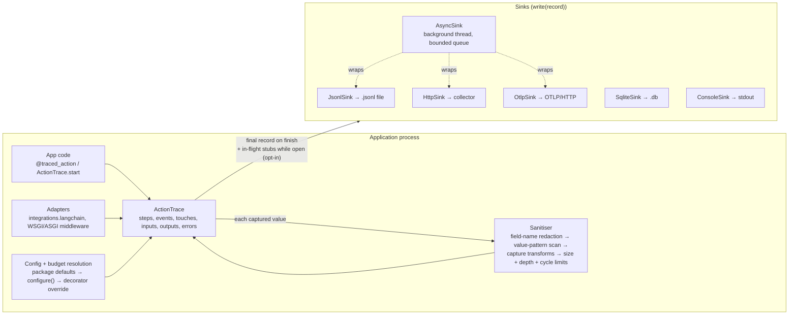
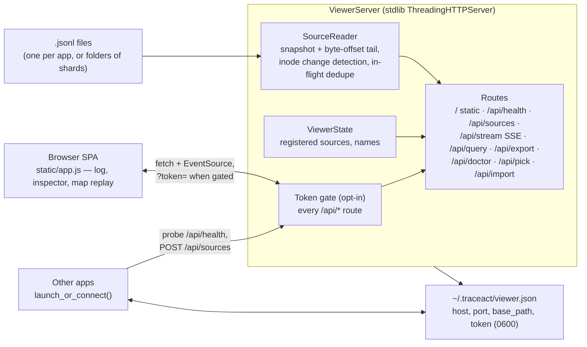

# TraceAct Architecture

How the pieces fit together, for visual readers. The full API reference is
[USAGE.md](https://github.com/traceact/traceact/blob/main/USAGE.md); the
record schema is in its
[Trace record schema](https://github.com/traceact/traceact/blob/main/USAGE.md#trace-record-schema)
section.

## Recording pipeline

Every trace record follows one path from application code to storage:

Ordering facts that constrain extensions:

- The sanitiser runs at capture time (`trace.input()`, `trace.event()`),
  **before** any sink sees the record. A sink cannot recover a value the
  sanitiser removed; anything that must bypass a limit (for example large
  binary payloads) is spooled by the recording side and referenced from the
  record.
- The final record is written once, when the trace finishes. With
  `stream_progress` enabled, slim `in_flight` stub lines are additionally
  appended while the trace is open (grace threshold, per-interval throttle,
  heartbeat, error snapshots carry the full record); the final record
  supersedes them and readers collapse last-wins per `trace_id`.
- Sink failures never raise into the traced application: `strict=False`
  (the default) reports them to stderr; per-sink counters
  (`AsyncSink.dropped`, `HttpSink.failed`, `OtlpSink.failed`) make loss
  observable.

## Viewer

Coordination contracts:

- **Single instance**: a shared viewer records host, port, `base_path`, and
  token (when gated) in `~/.traceact/viewer.json` (mode 0600). Later
  launches probe `/api/health` before reusing; a viewer started with
  `--new` or an explicit `--port` never writes or clears the state file.
- **Base path**: with `--base-path /prefix`, every route moves under the
  prefix and the server answers nothing outside it, so a reverse proxy can
  mount the viewer inside another app without route collisions.
- **Token gate**: with `--require-token`, every `/api/*` request needs the
  token (header or query param); the page shell and static assets stay
  open. The token travels only via the printed URL and the state file.
- **Selection is explicit**: a tab opened without `?source=` shows the
  source picker; launch paths that know their source pin it in the URL.

## Component contracts

| Component | Responsibility | Contract |
|---|---|---|
| `trace.py` — `ActionTrace` | Trace lifecycle, recording methods, parent/child linking, budgets, in-flight streaming | Never raises into the app under `strict=False`; parent from ambient context or explicit `parent=`; suppressed parents suppress children |
| `decorators.py` — `@traced_action` | Wrap sync/async callables; argument capture with per-field transforms | Capture spec validated at decoration time; wrapper decided at decoration, not call time |
| `config.py` — `configure()` / `TraceConfig` | Package-level settings, validation | Spellings validated at construction; package `capture_inputs=False` is a kill switch no decorator overrides |
| `redaction.py` | Field-name patterns, presets, value-pattern registry | `VALUE_PATTERNS` admits only near-unmistakable credential formats; registry mirrored in USAGE.md and pinned by tests |
| `sinks.py` | Destinations; buffering; rotation; export formats | A sink is any object with `write(record)`; wrapping composes (`AsyncSink(inner)`); failures counted, never raised |
| `log.py` — `TraceLog` | Programmatic queries over JSONL | Terminal calls re-read the source; bounded memory for `last`/`first`/`query`; collapses in-flight stubs, keeps orphaned ones |
| `propagation.py` / `middleware.py` | Cross-service linking via two headers | `traceact-trace-id` → `upstream_trace_id` (lineage); `traceact-correlation-id` passed through untouched (grouping) |
| `viewer/server.py` | HTTP surface | All routes under one handler; token and base-path checks before dispatch |
| `viewer/reader.py` — `SourceReader` | Snapshot + live tail | Byte offsets per file; inode change forces full re-snapshot; last-wins in-flight dedupe |
| `viewer/instance.py` | Single-instance coordination, `launch_or_connect()` | State-file probe before reuse; running instance's base path and token win |
| `integrations/` | Optional framework adapters | Import their framework only when imported themselves; `import traceact` stays zero-dependency; adapter callbacks never raise into the host |

## Event vocabulary

`kind` is an open vocabulary; the standard values (`app`, `db`, `http`,
`file`, `model`, `cache`, `queue`, `auth`, `payment`, `email`, `export`,
`job`, `tool`, `gate`, `qstate`) get documented touch derivation and OTLP
mapping, and any other kind (`retrieval`, `assertion`, …) passes through
every surface unchanged, deriving its own name as its touch kind. Extending TraceAct starts with vocabulary
(no changes needed), then a recording-side adapter (`integrations/`), and
only reaches a custom sink when storage itself must differ.
