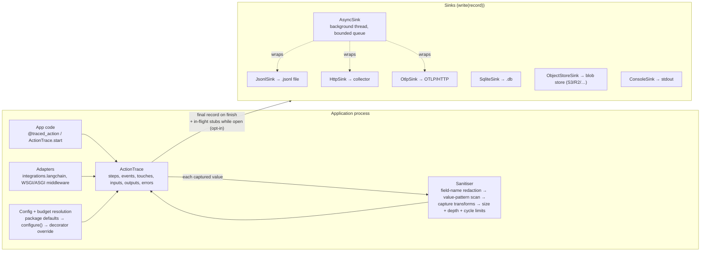
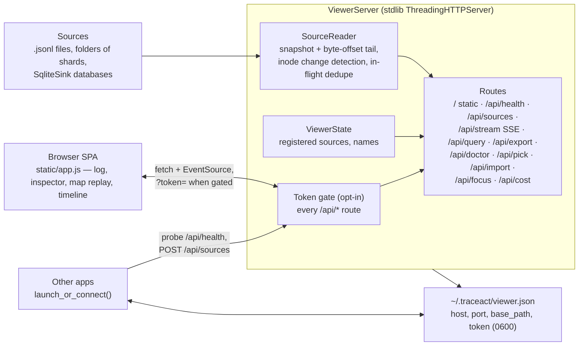

# TraceAct Architecture

How the pieces fit together, for visual readers. The full API reference is
[USAGE.md](https://github.com/traceact/traceact/blob/main/USAGE.md); the
record schema is in its
[Trace record schema](https://github.com/traceact/traceact/blob/main/USAGE.md#trace-record-schema)
section.

## Recording pipeline

Every trace record follows one path from application code to storage:

Ordering facts that constrain extensions:

- The sanitiser runs at capture time (`trace.input()`, `trace.event()`),
  **before** any sink sees the record. A sink can't recover a value the
  sanitiser removed; anything that must bypass a limit (for example large
  binary payloads) is spooled by the recording side and referenced from the
  record.
- The final record is written once, when the trace finishes. With
  `stream_progress` enabled, slim `in_flight` stub lines are additionally
  appended while the trace is open (grace threshold, per-interval throttle,
  heartbeat, error snapshots carry the full record); the final record
  supersedes them and readers collapse last-wins per `trace_id`.
- Sink failures never raise into the traced application: `strict=False`
  (the default) reports them to stderr; per-sink counters
  (`AsyncSink.dropped`, `HttpSink.failed`, `OtlpSink.failed`,
  `ObjectStoreSink.failed`) make loss observable.

## Viewer

Coordination contracts:

- **Single instance**: a shared viewer records host, port, `base_path`, and
  token (when gated) in `~/.traceact/viewer.json` (mode 0600). Later
  launches probe `/api/health` before reusing; a viewer started with
  `--new` or an explicit `--port` never writes or clears the state file.
- **Base path**: with `--base-path /prefix`, every route moves under the
  prefix and the server answers nothing outside it, so a reverse proxy can
  mount the viewer inside another app without route collisions.
- **Token gate**: with `--require-token`, every `/api/*` request needs the
  token (header or query param); the page shell and static assets stay
  open. The token travels only via the printed URL and the state file.
- **Selection is explicit**: a tab opened without `?source=` shows the
  source picker; launch paths that know their source pin it in the URL.
- **Deep-linking to the map**: `traceact view SOURCE --map` adds
  `view=map&open=latest` to the opened URL. `view` sets the initial tab;
  `open` auto-selects the newest trace the moment it arrives over the live
  stream, once, so it never fights a later manual selection. Without the
  flag both params are absent and behaviour is unchanged.
- **Focus hook**: `traceact view SOURCE --focus-hook URL` fixes a hook URL
  at server start (validated http(s), advertised as a boolean in
  `/api/health`, printed at startup). The page renders Focus controls only
  when the boolean is true; a click POSTs the full record to the server's
  own `POST /api/focus`, which forwards it to the hook URL — server-side,
  so a hook consumer needs no CORS handling and the URL never reaches the
  page. Non-2xx, a refused redirect, or no answer within ~1s comes back as
  `502` and surfaces as a brief notice; the forward runs on the request's
  own thread, so a slow hook delays only its own click. Unknown record
  fields pass through the whole chain (file → reader → SSE → page → hook)
  untouched — hook consumers depend on fields traceact doesn't define. A
  non-loopback hook auto-enables the token gate above. See Security
  considerations below for the outbound guard this route shares with
  `HttpSink`/`OtlpSink`/`ObjectStoreSink`.
- **Cost estimates**: `GET /api/cost` prices one model call via the optional
  rates package (`viewer/cost.py`). Display-time only — capture-time
  stamping was considered and rejected, because a stamped cost freezes
  whatever price snapshot happened to be installed when the trace was
  written and would put a dependency on the recording path. The price
  registry loads once per process from rates' bundled snapshot (never the
  network), `/api/health` advertises availability as `cost_estimates`, and
  the page renders cost UI only when it's true. The provider must come from
  the event itself: one model id is sold by many providers at different
  prices, so an event without one gets a hint, never a guessed number.
  rates traces its own loads with traceact, so the viewer CLI — as the
  process's app — routes package tracing to a capped
  `~/.traceact/viewer-traces.jsonl` at startup, only when nothing else
  configured a sink first; embedded servers leave the host app's
  configuration untouched.

## Component contracts

| Component | Responsibility | Contract |
|---|---|---|
| `trace.py` — `ActionTrace` | Trace lifecycle, recording methods, parent/child linking, budgets, in-flight streaming, ending classification | Never raises into the app under `strict=False`; parent from ambient context or explicit `parent=`; suppressed parents suppress children; every BaseException ending is recorded and re-raised — cancellation (`asyncio.CancelledError`, `KeyboardInterrupt`) as `cancelled`, the rest as `failed` |
| `decorators.py` — `@traced_action` | Wrap sync/async callables; argument capture with per-field transforms | Capture spec validated at decoration time; wrapper decided at decoration, not call time |
| `helpers.py` — `TraceHelpersMixin` | Kind-specific event shorthands on the trace object (`db`, `http`, `file`, `model`, `tool`, `queue`) | Thin wrappers over `event()`; one resource field name (`target`) across all kinds, no per-kind aliases |
| `ids.py` | Prefixed ID generation for traces, events, steps, and correlation groups | `{prefix}_{12 hex chars}` from `secrets`; the prefix names the record kind on sight |
| `config.py` — `configure()` / `TraceConfig` | Package-level settings, validation | Spellings validated at construction; package `capture_inputs=False` is a kill switch no decorator overrides |
| `redaction.py` | Field-name patterns, presets, value-pattern registry | `VALUE_PATTERNS` admits only near-unmistakable credential formats; registry mirrored in USAGE.md and pinned by tests |
| `sinks.py` | Destinations; buffering; rotation; export formats | A sink is any object with `write(record)`; wrapping composes (`AsyncSink(inner)`); failures counted, never raised |
| `log.py` — `TraceLog` | Programmatic queries over JSONL | Terminal calls re-read the source; bounded memory for `last`/`first`/`query`; collapses in-flight stubs, keeps orphaned ones; dots in a filter field walk nested paths (lists fan out over elements), `__` stays the operator |
| `propagation.py` / `middleware.py` | Cross-service linking via two headers | `traceact-trace-id` → `upstream_trace_id` (lineage); `traceact-correlation-id` passed through untouched (grouping) |
| `viewer/server.py` | HTTP surface | All routes under one handler; token and base-path checks before dispatch |
| `viewer/reader.py` — `SourceReader` | Snapshot + live tail (JSONL and SQLite) | Byte offsets per file / autoincrement-id cursor per database; a changed inode, a changed first-bytes fingerprint (inode numbers get reused, routinely on Linux), or a reset id sequence all force a full re-snapshot; last-wins in-flight dedupe; SQLite reads are read-only with a 0.5s timeout |
| `viewer/instance.py` | Single-instance coordination, `launch_or_connect()` | State-file probe before reuse; running instance's base path and token win |
| `viewer/cost.py` | Cost estimates for model events via the optional rates package | rates imported lazily, on the first estimate; registry loaded once, bundled snapshot only; never touches traceact's global configuration; ambiguous or unknown provider+model pairs refused, never guessed |
| `integrations/` | Optional framework adapters | Import their framework only when imported themselves; `import traceact` stays zero-dependency; adapter callbacks never raise into the host |

This table carries the components whose contracts constrain extensions; the
complete per-file map, small support modules included, is
[MANIFEST.md](https://github.com/traceact/traceact/blob/main/MANIFEST.md).

## Security considerations

`traceact._netguard` is the one outbound-network guard shared by every place
TraceAct makes an HTTP(S) call on the caller's behalf: `HttpSink`,
`OtlpSink`, `ObjectStoreSink`'s backend, and the viewer's `POST /api/focus`
forward. One implementation,
so a change to the policy fixes every caller instead of drifting apart.

- **Redirects are never followed**, on every one of these paths — a validated
  destination that answers with a redirect elsewhere bypasses whatever check
  just ran on the original URL, so nothing chases one.
- **Destination classification**: a hostname resolving to any private,
  link-local, reserved, multicast, or unspecified address is rejected
  unless the caller opts in (`allow_private_network=True`). Loopback is
  always permitted — it's the machine TraceAct itself runs on, and the
  common case (a local collector, the `traceact-browser` relay). A hostname
  with even one such answer among several resolved addresses is rejected
  outright, narrowing a DNS-rebinding path where a caller who controls DNS
  alternates between a public answer (seen at the check) and a private one
  (used by whichever address ends up connecting). Narrowing, not closing:
  the check classifies the addresses resolved at check time, and the
  connection itself resolves again, so a window remains between check and
  connect. `network_policy="enforce"` re-checks before every write to keep
  that window as small as the current design allows; pinning the socket to
  the checked address would close it and is a candidate for a later pass.
- **Plain `http://` is loopback-only by default**; `allow_insecure_http`
  widens or narrows that.
- **`HttpSink`/`OtlpSink`/`S3Backend` default to `network_policy="warn"`**: an unsafe
  destination still delivers the same as before this guard existed —
  nothing that worked stops working — but emits a warning once, at
  construction. `network_policy="enforce"` re-checks before every write and
  turns a blocked destination into an ordinary counted delivery failure,
  never an attempted connection. The focus hook forward refuses redirects
  unconditionally (it's new surface with no prior deployments to keep
  compatible), but doesn't gate the destination itself beyond the existing
  http(s)-only validation — passing `--focus-hook` at all is explicit
  operator consent to that URL.
- **Request bodies are capped** on every POST route (`/api/focus`,
  `/api/sources`, `/api/import`) — `Content-Length` past the limit gets
  `413` before the body is read into memory. `/api/import` carries a
  dropped `.jsonl` file's whole content, so it raises the cap well past the
  other two routes' single-record/single-path payloads.
- **A non-loopback focus hook auto-enables the token gate** (see Viewer
  above) even without `--require-token` — a hook pointed off this machine
  gives the API a reason to be reached from somewhere other than "whatever
  runs locally."

## Event vocabulary

`kind` is an open vocabulary; the standard values (`app`, `db`, `http`,
`file`, `model`, `cache`, `queue`, `auth`, `payment`, `email`, `export`,
`job`, `tool`, `gate`, `qstate`) get documented touch derivation and OTLP
mapping, and any other kind (`retrieval`, `assertion`, …) passes through
every surface unchanged, deriving its own name as its touch kind. Extending TraceAct starts with vocabulary
(no changes needed), then a recording-side adapter (`integrations/`), and
only reaches a custom sink when storage itself must differ.
